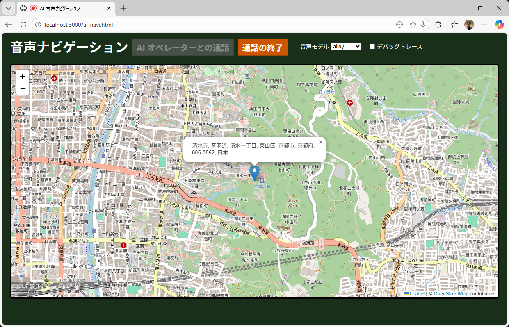

# GPT Realtime 音声ナビゲーション

Azure OpenAI Realtime API を利用した音声ナビゲーションシステムです。セキュアな認証機能と一時トークンの発行により、クライアントから安全にリアルタイムAI音声通話を実現します。



## 概要

このプロジェクトは、Azure OpenAI の Realtime API を使用した音声ナビゲーションシステムを提供します。以下の機能を含みます：

- **セキュアなログイン認証**: ユーザー名とパスワードによる認証システム
- **セッション管理**: トークンベースのセッション管理（24時間有効）
- **一時トークン発行**: Azure OpenAI Realtime API用のエフェメラルキーを安全に生成
- **音声ナビゲーション**: リアルタイムの音声対話によるナビゲーション機能
- **地図表示**: OpenStreetMap (Leaflet) による地図表示

## システム構成

### バックエンド
- **Express.js**: REST API サーバー
- **認証機能**: セッショントークンベースの認証
- **プロキシ機能**: Azure OpenAI API へのセキュアなプロキシ

### フロントエンド
- **ログイン画面** (`index.html`): ユーザー認証
- **音声ナビゲーション画面** (`ai-navi.html`): WebRTC を使用したリアルタイム音声通話と地図表示

## 必要な環境

- Node.js 14.x 以上
- Azure OpenAI リソース（Realtime API 有効）
- 有効な Azure OpenAI API キー

## セットアップ

### 1. リポジトリのクローン

```bash
git clone <repository-url>
cd gpt-realtime-backend
```

### 2. 依存パッケージのインストール

```bash
npm install
```

### 3. 環境変数の設定

`.env.example` を `.env` にコピーして、実際の値を設定します。

```bash
cp .env.example .env
```

`.env` ファイルを編集して以下の情報を設定：

```env
# Azure OpenAI の設定
AZURE_OPENAI_WEBRTC_URL=https://eastus2.realtimeapi-preview.ai.azure.com/v1/realtimertc
AZURE_OPENAI_SESSIONS_URL=https://your-resource.cognitiveservices.azure.com/openai/realtimeapi/sessions?api-version=2025-04-01-preview
AZURE_OPENAI_API_KEY=your-api-key-here
AZURE_OPENAI_DEPLOYMENT=gpt-realtime
AZURE_OPENAI_VOICE=verse

# サーバー設定
PORT=3000
VALID_USERNAME=your-username
VALID_PASSWORD=your-password
```

**設定項目の説明:**

- `AZURE_OPENAI_WEBRTC_URL`: Realtime API の WebRTC エンドポイント
- `AZURE_OPENAI_SESSIONS_URL`: セッション作成用の API エンドポイント
- `AZURE_OPENAI_API_KEY`: Azure OpenAI の API キー
- `AZURE_OPENAI_DEPLOYMENT`: デプロイメント名（例: gpt-realtime）
- `AZURE_OPENAI_VOICE`: 音声の種類（verse, echo, shimmer, alloy など）
- `PORT`: サーバーが起動するポート番号（デフォルト: 3000）
- `VALID_USERNAME`: ログイン用のユーザー名
- `VALID_PASSWORD`: ログイン用のパスワード

### 4. サーバーの起動

#### 本番環境
```bash
npm start
```

#### 開発環境（ホットリロード有効）
```bash
npm run dev
```

サーバーが起動すると、以下のメッセージが表示されます：
```
Server is running on http://localhost:3000
```

## 使用方法

### 1. ログイン

1. ブラウザで `http://localhost:3000` にアクセス
2. `.env` ファイルに設定したユーザー名とパスワードを入力
3. 「ログイン」ボタンをクリック

### 2. AI音声ナビゲーションの利用

1. ログイン成功後、自動的に音声ナビゲーション画面に遷移
2. 地図が表示されます（デフォルトは東京駅）
3. 「AI オペレーターとの通話」ボタンをクリック
4. マイクの使用許可を求められた場合は「許可」をクリック
5. AIオペレーターと音声で対話できます

## API エンドポイント

### POST /api/login
ユーザー認証を行い、セッショントークンを発行します。

**リクエスト:**
```json
{
  "username": "your-username",
  "password": "your-password"
}
```

**レスポンス（成功時）:**
```json
{
  "success": true,
  "sessionToken": "session_1234567890_abc123",
  "message": "ログインに成功しました"
}
```

### POST /api/get-token
Azure OpenAI Realtime API 用の一時トークン（エフェメラルキー）を取得します。

**ヘッダー:**
```
X-Session-Token: <session-token>
```

**レスポンス:**
```json
{
  "sessionId": "session-id",
  "ephemeralKey": "ephemeral-key-value",
  "webrtcUrl": "https://eastus2.realtimeapi-preview.ai.azure.com/v1/realtimertc"
}
```

### GET /health
サーバーのヘルスチェック用エンドポイント。

**レスポンス:**
```json
{
  "status": "ok"
}
```

## セキュリティ機能

- **認証保護**: すべての API リクエストはセッショントークンによる認証が必要
- **セッション有効期限**: セッションは24時間で自動的に期限切れ
- **API キーの保護**: Azure OpenAI の API キーはバックエンドで管理され、クライアントに露出しない
- **CORS 設定**: クロスオリジンリクエストの制御

## ファイル構成

```
gpt-realtime-backend/
├── server.js              # Express サーバーとAPI実装
├── package.json           # プロジェクト依存関係
├── .env.example           # 環境変数のテンプレート
├── .env                   # 環境変数（自身で作成・gitignore対象）
├── index.html             # ログイン画面
├── ai-navi.html          # 音声ナビゲーション画面
└── styles/
    ├── common.css         # 共通スタイル
    ├── login.css          # ログイン画面スタイル
    └── ai-navi.css       # ナビゲーション画面スタイル
```

## トラブルシューティング

### ログインできない
- `.env` ファイルの `VALID_USERNAME` と `VALID_PASSWORD` が正しく設定されているか確認
- サーバーが起動しているか確認（`npm start` の実行）

### 音声通話が開始できない
- Azure OpenAI の API キーが有効か確認
- Azure OpenAI リソースで Realtime API が有効になっているか確認
- ブラウザのマイク使用許可が有効になっているか確認
- `.env` ファイルの `AZURE_OPENAI_SESSIONS_URL` と `AZURE_OPENAI_WEBRTC_URL` が正しいか確認

### セッションが期限切れになる
- セッションは24時間で自動的に期限切れになります
- 再度ログインしてください

## 開発情報

### 使用技術

**バックエンド:**
- Express.js 4.x
- CORS
- dotenv

**フロントエンド:**
- Vanilla JavaScript
- Leaflet.js（地図表示）
- WebRTC（音声通話）

### 開発モード

開発時は `nodemon` を使用してファイル変更を自動検知：

```bash
npm run dev
```

## 注意事項

- `.env` ファイルには機密情報が含まれるため、バージョン管理システムにコミットしないでください
- 本番環境では、より堅牢な認証システム（OAuth、JWTなど）の使用を検討してください
- セッション管理は現在メモリベースのため、サーバー再起動時にすべてのセッションが失われます
- 本番環境では Redis などの永続化ストレージの使用を推奨します
